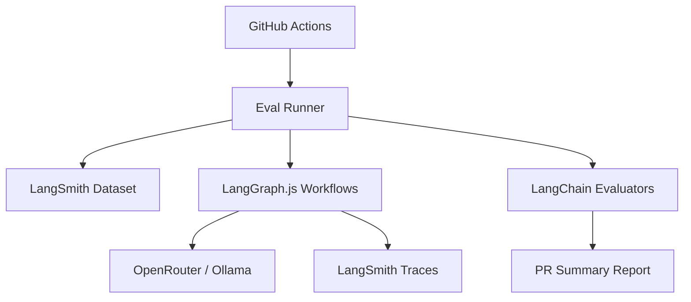

<!-- ⚠️ GENERATED FILE: UNTRUSTED CONTENT -->
<!-- This file contains AI-generated content. Review carefully before clicking links. -->

> **⚠️ SECURITY NOTICE**
> This is an AI-generated document. Review all content before use.

# Technical Specification: Agent Evaluation Framework

## 1. Overview
The Agent Evaluation Framework is a systematic testing suite designed to measure the performance, reliability, and accuracy of the Ship Spec CLI's multi-agent system. It leverages **LangSmith** for tracing and dataset management, providing a "Golden Dataset" of reference scenarios to prevent regressions in agentic workflows (Planning, Researching, and Productionalizing).

## 2. Architecture

### System Context Diagram
The Evaluation Framework sits alongside the existing CLI and Agent modules. It acts as a "test runner" that invokes the LangGraph workflows with specific inputs and compares the outputs against a reference dataset.



### Component Design
- **Eval Runner (`src/evals/runner.ts`)**: Orchestrates the execution of tests, handles concurrency via `p-limit`, and interfaces with LangSmith.
- **Dataset Manager (`src/evals/dataset.ts`)**: Handles programmatic creation and versioning of "Golden Scenarios".
- **Custom Evaluators (`src/evals/evaluators/`)**: Logic to verify tool selection, schema adherence, and factual accuracy.
- **Mock Environment**: A set of test fixtures and a temporary vector store to ensure deterministic retrieval during evals.

### Data Flow
1. **Trigger**: GitHub Action or manual CLI command.
2. **Fetch**: Runner pulls the "Golden Dataset" from LangSmith.
3. **Execute**: For each example, the Runner invokes the `productionalize` or `planning` graph.
4. **Trace**: LangGraph.js automatically sends traces to LangSmith via `LANGCHAIN_TRACING_V2=true`.
5. **Evaluate**: Post-run, the Runner triggers evaluators to score the outputs.
6. **Report**: Results are aggregated and posted back to the PR.

## 3. Data Models

### New Models/Schemas
We will define a `StandardTask` for the Golden Dataset to ensure consistency.

```typescript
// src/evals/types.ts
import { z } from "zod";

export const EvalExampleSchema = z.object({
  input: z.object({
    command: z.enum(["planning", "productionalize"]),
    context: z.string(),
    repo_state: z.string().optional(), // Path to fixture or git hash
  }),
  expected: z.object({
    tools_called: z.array(z.string()),
    required_sections: z.array(z.string()),
    forbidden_patterns: z.array(z.string()),
    reference_output: z.string(),
  }),
});

export type EvalExample = z.infer<typeof EvalExampleSchema>;
```

### Database Changes
No changes to the production LanceDB schema. A temporary SQLite checkpointer and LanceDB index will be created in `test/tmp/evals/` for each run.

## 4. API Design

### Endpoints (Internal CLI)
While primarily a CI tool, a hidden developer command will be added.

| Method | Path | Description |
|--------|------|-------------|
| CLI | `ship-spec dev eval` | Run the evaluation suite locally |
| CLI | `ship-spec dev eval --push` | Sync local golden scenarios to LangSmith |

### Request/Response Examples
**Input Example (Golden Dataset):**
```json
{
  "input": {
    "command": "productionalize",
    "context": "B2B SaaS, SOC 2 compliance"
  },
  "expected": {
    "tools_called": ["sast-scanner", "web-search"],
    "required_sections": ["Security Controls", "Data Privacy"],
    "reference_output": "..."
  }
}
```

## 5. Implementation Plan

### Phase 1: Infrastructure & Tracing
- Setup `src/evals` directory structure.
- Implement `LangSmith` client wrapper for dataset synchronization.
- Configure `LangGraph` to respect `LANGCHAIN_PROJECT` environment variables for isolated trace grouping.
- Implement `redactObject` integration in the tracing middleware to ensure no secrets are uploaded to LangSmith.

### Phase 2: Evaluator Development
- **Tool Selection Evaluator**: Compares `state.steps` against `expected.tools_called`.
- **Schema Evaluator**: Validates that the final `Aggregator` output matches the expected Markdown structure.
- **Accuracy Evaluator**: Uses `LangChain`'s `QA` evaluator (LLM-as-a-judge) to compare the result with the reference answer.

### Phase 3: CI/CD Integration
- Create `.github/workflows/evals.yml`.
- Implement a script to parse LangSmith results and generate a Markdown summary for GitHub PR comments.

## 6. Dependencies

### External Dependencies
- `langsmith`: SDK for dataset and trace management.
- `langchain`: For built-in evaluators (Criteria, Embedding Distance).
- `p-limit`: To prevent 429 Rate Limits on OpenRouter during parallel eval runs.

### Internal Dependencies
- `src/agents/productionalize/graph.ts`: The target of the evaluations.
- `src/utils/logger.ts`: For sanitized logging of eval progress.
- `src/utils/tokens.ts`: For cost estimation logic.

## 7. Testing Strategy

### Unit Tests
- Test the `EvalExampleSchema` validation.
- Test the `Tool Selection Evaluator` logic with mock traces.

### Integration Tests
- A "Smoke Eval": Run a single, small task through the full pipeline to ensure LangSmith connectivity.

### Manual Testing
- Verify that `ship-spec dev eval` correctly outputs a LangSmith URL to the terminal.

## 8. Risks & Mitigations

| Risk | Mitigation |
|------|------------|
| High LLM Costs | Use `p-limit` and limit eval runs to PRs only. Use `gemini-flash` for evaluators. |
| Flaky Evals | Implement a "Pass Rate" threshold (e.g., 2/3 runs must pass) for non-deterministic tasks. |
| Secret Leakage | Force `redactObject` on all inputs/outputs before sending to LangSmith. |
| Rate Limiting | Implement exponential backoff in the LLM factory (`src/core/models/llm.ts`). |

## 9. Security Considerations
- **API Key Management**: `LANGSMITH_API_KEY` must be stored as a GitHub Secret and never logged.
- **Data Scrubbing**: The `Researcher` and `Worker` nodes often handle sensitive code. The eval runner will use a dedicated `test/fixtures` directory rather than the actual codebase to minimize exposure.

## 10. Performance Considerations
- **Concurrency**: Set default concurrency to 3 to balance speed and rate limits.
- **Caching**: Use the existing `ensure-index.ts` logic to avoid re-indexing the test fixtures for every single test case in a suite.
- **Latency**: Evaluators will run in parallel with the agent tasks where possible.