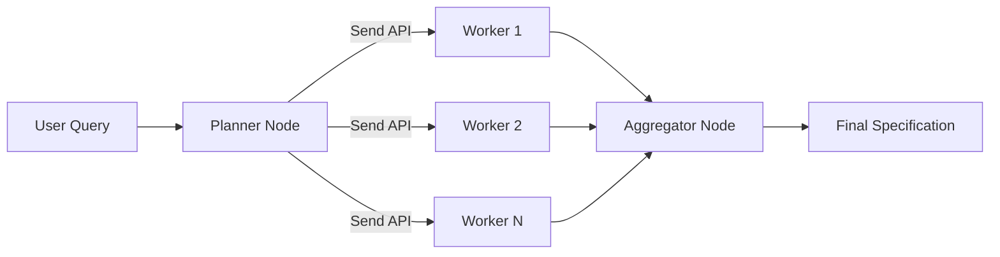

# AGENTS.md

## Project Overview

Ship Spec CLI is an autonomous semantic engine for codebase analysis and technical specification generation. It's a Retrieval-Augmented Generation (RAG) system that ingests source code, constructs vector embeddings, and uses LangGraph.js to orchestrate agentic workflows for generating implementation plans and documentation.

**Core Philosophy:** Local-First, Cloud-Optional — supports both local inference (Ollama) and cloud providers (OpenAI, Anthropic).

## Tech Stack

| Technology | Purpose |
|------------|---------|
| TypeScript | Core language (strict mode, ESM) |
| Commander.js | CLI framework |
| Zod | Schema validation |
| LanceDB | Embedded vector database |
| LangChain.js | AI model abstraction |
| LangGraph.js | Agentic workflow orchestration |
| Apache Arrow | Vector data types |
| Web-Tree-sitter | AST parsing for semantic chunking |
| fast-glob | High-performance file discovery |
| p-limit | Concurrency control |
| cli-progress | Progress bar display |
| chalk | Terminal styling |
| Vitest | Unit testing framework |

## Setup Commands

```bash
# Install dependencies
npm install

# Build the project
npm run build

# Run the CLI
npm start
# or
node dist/cli/index.js

# Development mode (watch)
npm run dev
```

## CLI Commands

### `ship-spec ingest`

Index the codebase into the vector store.

```bash
# Basic usage - index current directory
ship-spec ingest

# With options
ship-spec ingest --concurrency 20 --batch-size 100

# Dry run to see what files would be processed
ship-spec ingest --dry-run
```

**Options:**
- `--concurrency <n>` - Number of concurrent file processors (default: 10)
- `--batch-size <n>` - Documents per embedding batch (default: 50)
- `--dry-run` - Show files that would be processed without indexing

**Pipeline:**
1. Discovers source files using fast-glob (respects `ignorePatterns`)
2. Parses files with Tree-sitter for semantic chunking
3. Generates embeddings in batches
4. Stores vectors in LanceDB

### `ship-spec spec <prompt>`

Generate a technical specification based on a prompt.

```bash
# Basic usage
ship-spec spec "How does authentication work in this codebase?"

# Output to file
ship-spec spec "Explain the database layer" -o database-spec.md

# Disable streaming progress
ship-spec spec "Analyze the API routes" --no-stream

# Pipe output to file
ship-spec spec "Document the payment flow" > payment-spec.md
```

**Arguments:**
- `<prompt>` - The analysis prompt describing what to analyze

**Options:**
- `-o, --output <file>` - Write specification to file instead of stdout
- `--no-stream` - Disable streaming progress output
- `--checkpoint` - Enable state checkpointing for persistence
- `--thread-id <id>` - Thread ID for resuming a session (requires `--checkpoint`; auto-generated if not provided)

**Workflow:**
1. Initializes the LangGraph.js agent workflow
2. Planner decomposes query into subtasks
3. Workers retrieve and analyze code in parallel
4. Aggregator synthesizes findings into specification
5. Outputs markdown to stdout (or file with `-o`)

### `ship-spec productionalize [context]`

Analyze the codebase for production readiness.

```bash
# Basic usage
ship-spec productionalize

# With specific context
ship-spec productionalize "B2B SaaS handling PII, targeting SOC 2"

# Enable SAST scans
ship-spec productionalize --enable-scans
```

**Options:**
- `-o, --output <file>` - Write report to file instead of stdout
- `--tasks-output <file>` - Write Taskmaster JSON to file
- `--enable-scans` - Run SAST scanners (Semgrep, Gitleaks, Trivy)
- `--categories <list>` - Filter to specific categories (csv)
- `--no-stream` - Disable streaming progress output

**Workflow:**
1. **Gather Signals** - Deterministic scan for tech stack, CI, tests, etc.
2. **Researcher** - Web search for compliance standards (SOC 2, OWASP, SRE).
3. **SAST Scans** - Run external scanners if enabled and available.
4. **Planner** - Hybrid planner (core categories + dynamic signals).
5. **Workers** - Parallel analysis with code/web/scan routing.
6. **Aggregator** - Synthesize findings into Markdown report.
7. **Task Generator** - Generate agent-executable Taskmaster JSON.

### `ship-spec config`

Display the resolved configuration.

```bash
ship-spec config
```

### Global Options

```bash
ship-spec --help           # Show help
ship-spec --version        # Show version
ship-spec -v, --verbose    # Enable verbose logging
ship-spec -c, --config <path>  # Path to config file
```

## Development Commands

```bash
# Type checking
npm run typecheck

# Linting
npm run lint

# Build for production
npm run build

# Run tests
npm test

# Run tests in watch mode
npm run test:watch

# Run tests with coverage
npm run test:coverage
```

## Project Structure

```
src/
├── cli/                        # Command definitions
│   ├── index.ts               # CLI entry point (Commander.js)
│   └── commands/
│       ├── config.ts          # Display resolved configuration
│       ├── ingest.ts          # Index codebase with progress bar
│       └── spec.ts            # Generate specs with streaming output
├── config/
│   ├── schema.ts              # Zod schemas for configuration
│   └── loader.ts              # Config file & env var loader
├── core/
│   ├── analysis/              # NEW: Deterministic project signals
│   │   └── project-signals.ts
│   ├── checkpoint/
│   │   └── index.ts           # Checkpointer factory (MemorySaver/SQLite)
│   ├── models/
│   │   ├── embeddings.ts      # Embedding model factory
│   │   └── llm.ts             # Chat model factory
│   ├── parsing/
│   │   ├── index.ts           # Unified chunking entry point
│   │   ├── tree-sitter.ts     # WASM parser loader
│   │   ├── chunker.ts         # Semantic AST-based chunking
│   │   ├── fallback-splitter.ts # Text splitter for unsupported files
│   │   └── language-registry.ts # Language configs & queries
│   ├── storage/
│   │   ├── vector-store.ts    # LanceDB manager
│   │   └── repository.ts      # Document repository
│   └── types/
│       └── index.ts           # Shared TypeScript interfaces
├── agents/
│   ├── productionalize/       # NEW: Production readiness workflow
│   │   ├── graph.ts
│   │   ├── state.ts
│   │   └── nodes/
│   │       ├── aggregator.ts
│   │       ├── planner.ts
│   │       ├── researcher.ts
│   │       ├── task-generator.ts
│   │       └── worker.ts
│   ├── state.ts               # AgentState with Annotation.Root
│   ├── graph.ts               # Map-Reduce workflow with Send API
│   ├── nodes/
│   │   ├── planner.ts         # Query decomposition
│   │   ├── worker.ts          # Retrieval and summarization + context pruning
│   │   └── aggregator.ts      # Specification synthesis + findings truncation
│   └── tools/
│       ├── retriever.ts       # DocumentRepository tool wrapper
│       ├── sast-scanner.ts    # NEW: SAST tool wrapper
│       └── web-search.ts      # NEW: Web search tool (Tavily/DDG)
├── test/
│   ├── fixtures.ts            # Test fixtures (sample code)
│   ├── agents/                # Agent tests (state, nodes, tools, graph)
│   ├── cli/                   # CLI command tests
│   │   ├── commands/          # Unit tests for ingest, spec
│   │   └── integration.test.ts # End-to-end workflow tests
│   ├── core/                  # Unit tests (mirrors src/core)
│   │   └── checkpoint/        # Checkpointer factory tests
│   └── utils/                 # Utility function tests
│       └── tokens.test.ts     # Token counting/pruning tests
└── utils/
    ├── logger.ts              # Logging utilities with chalk
    ├── fs.ts                  # File system helpers
    └── tokens.ts              # Token counting and context pruning
```

## Code Style

- **TypeScript strict mode** — All code must pass `tsc --noEmit`
- **Strict Typing** — Use of `any` is strictly forbidden. Use of `unknown` should be minimized. Always define specific interfaces or types. Use Zod for validating external data.
- **ESM modules** — Use `.js` extensions in imports (e.g., `./schema.js`)
- **Zod validation** — All external inputs (config files, LLM outputs) must be validated
- **Provider abstraction** — Never import vendor SDKs directly in business logic; use factory functions

### Import Conventions

```typescript
// ✅ Correct: Use .js extension for local imports
import { loadConfig } from "../config/loader.js";

// ❌ Incorrect: Missing extension
import { loadConfig } from "../config/loader";
```

### Type Safety

- **Strict Typing** — Use of `any` is strictly forbidden. Avoid `unknown` where possible; instead, define specific interfaces or use Zod to parse and validate external data.

```typescript
import { z } from "zod";

// ✅ Correct: Use Zod to validate external data
const UserSchema = z.object({
  id: z.string(),
  name: z.string(),
});

type User = z.infer<typeof UserSchema>;

function handleUserResponse(data: unknown) {
  const user = UserSchema.parse(data); // Returns typed User or throws
  console.log(`Hello, ${user.name}`);
}

// ✅ Correct: Use specific interfaces for internal logic
interface ProjectConfig {
  path: string;
  depth: number;
}

function analyzeProject(config: ProjectConfig) {
  // ...
}

// ❌ Incorrect: Using any or unknown without validation
function handleData(data: any) {
  console.log(data.someProperty);
}
```

### Naming Conventions

- Files: `kebab-case.ts`
- Classes: `PascalCase`
- Functions/variables: `camelCase`
- Types/Interfaces: `PascalCase`
- Constants: `SCREAMING_SNAKE_CASE` for true constants, `camelCase` for config objects

## Configuration

The CLI supports multiple configuration sources (in priority order):

1. **Environment variables** — API keys via `.env`
2. **Config files** — `shipspec.json`, `.shipspecrc`, or `.shipspecrc.json`
3. **Zod defaults** — Sensible defaults for all options

### Key Environment Variables

```bash
OPENAI_API_KEY=         # For OpenAI embeddings/LLM
ANTHROPIC_API_KEY=      # For Anthropic LLM
OLLAMA_BASE_URL=        # Default: http://localhost:11434
```

### Config Schema (src/config/schema.ts)

The `ShipSpecConfigSchema` defines:
- `projectPath`: Root path to analyze
- `vectorDbPath`: LanceDB storage location (default: `.ship-spec/lancedb`)
- `ignorePatterns`: Glob patterns to exclude
- `llm`: Provider, model, temperature, retry, and token budget settings
- `embedding`: Provider, model, dimensions, and retry settings
- `checkpoint`: Checkpointing configuration for state persistence

### Example Configuration File

```json
{
  "projectPath": ".",
  "vectorDbPath": ".ship-spec/lancedb",
  "ignorePatterns": [
    "**/node_modules/**",
    "**/.git/**",
    "**/dist/**",
    "**/*.test.ts"
  ],
  "llm": {
    "provider": "openai",
    "modelName": "gpt-5.2-2025-12-11",
    "temperature": 0,
    "maxRetries": 3,
    "timeout": 60000,
    "maxContextTokens": 16000,
    "reservedOutputTokens": 4000
  },
  "embedding": {
    "provider": "openai",
    "modelName": "text-embedding-3-large",
    "dimensions": 3072,
    "maxRetries": 3
  },
  "checkpoint": {
    "enabled": false,
    "type": "memory",
    "sqlitePath": ".ship-spec/checkpoint.db"
  }
}
```

## Vector Database

LanceDB is used as an embedded, serverless vector store:

- **Schema:** `CodeChunk` interface in `src/core/types/index.ts`
- **Dimensions:** Must match the embedding model (OpenAI: 3072, Ollama nomic-embed-text: 768)
- **Hybrid search:** Full-text search index created on `content` field
- **Auto-migration:** Table is recreated if dimension mismatch detected

### CodeChunk Schema

```typescript
// src/core/types/index.ts
export interface CodeChunk {
  id: string;          // UUID
  content: string;     // Source code
  filepath: string;    // Relative path
  startLine: number;   // 1-indexed start line
  endLine: number;     // 1-indexed end line
  language: string;    // "typescript" | "python" | etc.
  type: string;        // "function" | "class" | "interface" | "module"
  name?: string;       // Symbol name if available
  vector?: number[];   // Embedding (added by repository)
}
```

## Adding New Features

### Adding a New Embedding Provider

1. Update `ModelProviderSchema` in `src/config/schema.ts`
2. Add case to switch statement in `src/core/models/embeddings.ts`
3. Install the corresponding `@langchain/*` package

### Adding a New CLI Command

1. Create `src/cli/commands/<command>.ts`
2. Export a `Command` instance
3. Register in `src/cli/index.ts` via `program.addCommand()`

### Adding a New Language for Tree-sitter Parsing

1. Add the language type to `SupportedLanguage` in `src/core/parsing/language-registry.ts`
2. Add the language config to `LANGUAGE_REGISTRY` with:
   - `extensions`: File extensions (e.g., `[".rb"]`)
   - `wasmName`: Name in `tree-sitter-wasms` package
   - `queries`: Tree-sitter S-expression queries for functions/classes
   - `commentPrefix`: Comment style (`//`, `#`, etc.)
3. Verify WASM binary exists in `tree-sitter-wasms` package
4. Add tests in `src/test/core/parsing/`

### Adding a New Agent Node

1. Create a new node file in `src/agents/nodes/`
2. Export a factory function that accepts required dependencies (e.g., `model`, `tools`)
3. Return an async function that accepts `AgentStateType` and returns a partial state update
4. Register the node in `src/agents/graph.ts` using `.addNode()`
5. Connect it to the graph with `.addEdge()` or `.addConditionalEdges()`
6. Add tests in `src/test/agents/nodes/`

### Modifying the Graph Topology

1. Edit `src/agents/graph.ts`
2. Use `StateGraph` methods:
   - `.addNode(name, nodeFunction)` - Add a node
   - `.addEdge(from, to)` - Add a direct edge
   - `.addConditionalEdges(from, conditionFn)` - Add conditional routing
   - Use `Send` API for parallel fan-out (Map-Reduce pattern)
3. Ensure state reducers handle updates correctly
4. Update tests in `src/test/agents/graph.test.ts`

## Testing

The project uses **Vitest** for unit testing with comprehensive coverage of core modules.

### Test Structure

- **Location:** `src/test/` directory, mirroring the `src/core/` structure
- **Naming:** `<module>.test.ts`
- **Fixtures:** Shared test fixtures in `src/test/fixtures.ts`

### Running Tests

```bash
npm test              # Run all tests
npm run test:watch    # Watch mode
npm run test:coverage # Coverage report
```

### Current Test Coverage

| Module | Tests |
|--------|-------|
| `agents/state` | Reducer behavior for subtasks/context merging |
| `agents/nodes/planner` | Subtask decomposition with structured output |
| `agents/nodes/worker` | Retrieval and summarization logic |
| `agents/nodes/aggregator` | Final specification synthesis |
| `agents/tools/retriever` | DocumentRepository tool wrapper |
| `agents/graph` | Graph topology and node integration |
| `cli/commands/ingest` | File discovery, batch processing, progress bar |
| `cli/commands/spec` | Graph streaming, output formatting |
| `cli/integration` | End-to-end ingest and query workflow |
| `core/models/embeddings` | Factory function, provider validation |
| `core/models/llm` | Chat model factory with initChatModel |
| `core/parsing/tree-sitter` | WASM loading, parser initialization |
| `core/parsing/chunker` | Semantic chunking, comment coalescing |
| `core/parsing/fallback-splitter` | Text splitting for unsupported files |
| `core/parsing/language-registry` | Extension detection, language configs |
| `core/storage/vector-store` | LanceDB connection, table management |
| `core/storage/repository` | Document CRUD, similarity search |

### Writing Tests

```typescript
import { describe, it, expect, beforeEach, afterEach } from "vitest";
import { createTempDir, cleanupTempDir } from "../../fixtures.js";

describe("MyModule", () => {
  let tempDir: string;

  beforeEach(async () => {
    tempDir = await createTempDir();
  });

  afterEach(async () => {
    await cleanupTempDir(tempDir);
  });

  it("should do something", () => {
    expect(true).toBe(true);
  });
});
```

## Common Patterns

### Factory Pattern for Models

```typescript
// src/core/models/embeddings.ts
export async function createEmbeddingsModel(config: EmbeddingConfig): Promise<Embeddings> {
  switch (config.provider) {
    case "openai":
      return new OpenAIEmbeddings({ ... });
    case "ollama":
      return new OllamaEmbeddings({ ... });
    default:
      throw new Error(`Unsupported provider: ${config.provider}`);
  }
}
```

### Repository Pattern for Storage

```typescript
// src/core/storage/repository.ts
class DocumentRepository {
  async addDocuments(chunks: CodeChunk[]): Promise<void>
  async similaritySearch(query: string, k: number): Promise<CodeChunk[]>
  async hybridSearch(query: string, k: number): Promise<CodeChunk[]>
  async deleteByFilepath(filepath: string): Promise<void>
}
```

### Semantic Chunking with Tree-sitter

```typescript
// src/core/parsing/index.ts — Unified entry point
import { chunkSourceFile } from "./index.js";

const chunks = await chunkSourceFile(filepath, content, {
  minChunkSize: 50,
  maxChunkSize: 4000,
  includeComments: true,
});
```

### Language Registry Pattern

```typescript
// src/core/parsing/language-registry.ts
export const LANGUAGE_REGISTRY: Record<SupportedLanguage, LanguageConfig> = {
  typescript: {
    extensions: [".ts", ".tsx"],
    wasmName: "typescript",
    queries: {
      functions: "(function_declaration name: (identifier) @name) @func",
      classes: "(class_declaration name: (type_identifier) @name) @class",
      interfaces: "(interface_declaration name: (type_identifier) @name) @interface",
    },
    commentPrefix: "//",
  },
  // ... python, javascript, go, rust
};
```

### Supported Languages

| Language | Extensions | Features |
|----------|------------|----------|
| TypeScript | `.ts`, `.tsx` | Functions, classes, interfaces |
| JavaScript | `.js`, `.jsx`, `.mjs` | Functions, classes |
| Python | `.py` | Functions, classes with docstrings |
| Go | `.go` | Functions, methods, structs |
| Rust | `.rs` | Functions, structs, enums, traits |

Files with unsupported extensions (`.json`, `.yaml`, `.md`, etc.) are processed with the fallback text splitter.

## Agentic Workflow

The system uses a **Map-Reduce pattern** implemented with LangGraph.js to orchestrate intelligent code analysis:

### Workflow Architecture



### State Schema

The `AgentState` (defined in `src/agents/state.ts`) manages:

- **`userQuery`**: Original user request
- **`subtasks`**: Dynamically generated subtasks with status tracking
  - Reducer merges updates by subtask ID
- **`messages`**: Conversation history for LLM context
  - Reducer concatenates messages
- **`context`**: Accumulated code chunks from retrievals
  - Reducer appends new chunks
- **`finalSpec`**: Generated technical specification

### Node Responsibilities

1. **Planner Node** (`src/agents/nodes/planner.ts`):
   - Takes user query
   - Uses LLM with structured output (Zod) to decompose into 3-7 focused subtasks
   - Each subtask has an ID and specific query

2. **Worker Node** (`src/agents/nodes/worker.ts`):
   - Receives a single subtask via `Send` API
   - Uses `retrieve_code` tool to find relevant code chunks
   - Summarizes findings for that specific subtask
   - Updates subtask status to "complete" with result

3. **Aggregator Node** (`src/agents/nodes/aggregator.ts`):
   - Collects all completed subtask results
   - Synthesizes findings into a comprehensive markdown specification
   - Sets `finalSpec` in state

### Invoking the Graph

```typescript
import { createSpecGraph } from "./agents/graph.js";
import { DocumentRepository } from "./core/storage/repository.js";
import { loadConfig } from "./config/loader.js";

const config = await loadConfig();
const repository = new DocumentRepository(/* ... */);
const graph = await createSpecGraph(config, repository);

const result = await graph.invoke({
  userQuery: "How does authentication work in this codebase?",
});

console.log(result.finalSpec); // Generated specification
```

### Retriever Tool

The `retrieve_code` tool (`src/agents/tools/retriever.ts`) wraps `DocumentRepository.hybridSearch()` as a LangChain `DynamicStructuredTool`, enabling LLMs to semantically search the codebase during analysis.

## Advanced Features

### Checkpointing

State persistence allows resuming long-running analysis sessions:

```typescript
import { createCheckpointer } from "./core/checkpoint/index.js";

// Create in-memory checkpointer (for development)
const checkpointer = await createCheckpointer("memory");

// Create SQLite-backed checkpointer (for persistence)
const checkpointer = await createCheckpointer("sqlite", ".ship-spec/checkpoint.db");

// Pass to graph
const graph = await createSpecGraph(config, repository, { checkpointer });

// Invoke with thread ID for resumable sessions
const result = await graph.invoke(
  { userQuery: "..." },
  { configurable: { thread_id: "session-123" } }
);
```

**CLI Usage:**
```bash
# Enable checkpointing with auto-generated thread ID
ship-spec spec "Analyze auth flow" --checkpoint

# Resume a specific session
ship-spec spec "Continue analysis" --checkpoint --thread-id session-123

# Thread ID is auto-generated if not provided when checkpoint is enabled
# Format: session-{timestamp}
```

**Configuration:**
```json
{
  "checkpoint": {
    "enabled": true,
    "type": "sqlite",
    "sqlitePath": ".ship-spec/checkpoint.db"
  }
}
```

### Retry Logic

Automatic retries with exponential backoff for resilient API calls:

```json
{
  "llm": {
    "provider": "ollama",
    "modelName": "llama2",
    "maxRetries": 5,
    "timeout": 60000
  },
  "embedding": {
    "provider": "openai",
    "modelName": "text-embedding-3-large",
    "maxRetries": 3
  }
}
```

- `maxRetries`: Number of retry attempts (default: 3, max: 10)
- `timeout`: Request timeout in milliseconds (optional)

### Token Management

Intelligent context pruning prevents LLM context overflow:

```json
{
  "llm": {
    "maxContextTokens": 16000,
    "reservedOutputTokens": 4000
  }
}
```

- `maxContextTokens`: Maximum tokens for input context (default: 16000)
- `reservedOutputTokens`: Tokens reserved for model output (default: 4000)

The worker node automatically prunes retrieved code chunks to fit within the token budget. The aggregator node truncates accumulated findings if they exceed the available context.

## Next Steps

Future enhancements could include:
- Human-in-the-loop workflows with interruption points
- Multi-model routing for specialized tasks
- Incremental re-indexing for changed files
- Custom embedding fine-tuning for domain-specific codebases

## Troubleshooting

### "Dimension mismatch" warning

The embedding dimensions changed (e.g., switched from OpenAI to Ollama). The table will be automatically recreated, but existing vectors are lost. Re-run `ingest` to rebuild.

### ESM import errors

Ensure all local imports use `.js` extension. TypeScript compiles `.ts` to `.js`, but import paths are not rewritten.

### WASM loading failures

If Tree-sitter fails to parse a file, it will automatically fall back to text splitting. Common causes:

- Missing WASM file: Ensure `tree-sitter-wasms` package is installed
- Syntax errors in source: Malformed code triggers fallback gracefully
- Memory issues: Very large files may exceed WASM limits

Check logs with `--verbose` flag to see which files used fallback parsing.

### "No indexed data found" error

Run `ship-spec ingest` before running `ship-spec spec`. The spec command requires an indexed codebase.

### API key errors

Ensure your API keys are set in the `.env` file or as environment variables:

```bash
# For OpenAI (default)
export OPENAI_API_KEY=sk-...

# For Anthropic
export ANTHROPIC_API_KEY=sk-ant-...

# For Ollama (local)
export OLLAMA_BASE_URL=http://localhost:11434
```

### Ollama connection refused

If using Ollama, ensure the server is running:

```bash
ollama serve
```
