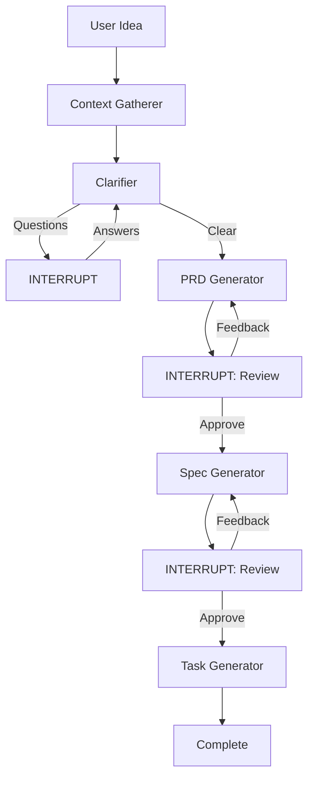

# AGENTS.md

## Project Overview

Ship Spec CLI is an autonomous semantic engine for codebase analysis and production readiness evaluation. It's a Retrieval-Augmented Generation (RAG) system that ingests source code, constructs vector embeddings, and uses LangGraph.js to orchestrate agentic workflows for analyzing technical debt and security. The CLI now ships with an OpenTUI-based terminal UI (Bun + SolidJS) and a Node backend that communicate via NDJSON RPC; `--headless` keeps the Commander-based command set for CI/CD.

**Core Philosophy:** Local-First, Cloud-Optional — supports both local inference (Ollama) and cloud providers via OpenRouter (Gemini, Claude, GPT).

## Tech Stack

| Technology | Purpose |
|------------|---------|
| TypeScript | Core language (strict mode, ESM) |
| Commander.js | Headless CLI routing |
| Bun | TUI runtime/build tooling |
| OpenTUI | Terminal UI renderer |
| SolidJS | TUI component framework |
| Zod | Schema validation |
| LanceDB | Embedded vector database |
| LangChain.js | AI model abstraction |
| LangGraph.js | Agentic workflow orchestration |
| Apache Arrow | Vector data types |
| Web-Tree-sitter | AST parsing for semantic chunking |
| fast-glob | High-performance file discovery |
| p-limit | Concurrency control |
| chalk | Terminal styling |
| Vitest | Unit testing framework |

## Setup Commands

```bash
# Install dependencies
npm install
cd tui && bun install

# Build the project
npm run build

# Run the CLI (launches TUI when in a TTY)
npm start
# or
node dist/cli/index.js

# Development mode (watch)
npm run dev

# TUI development mode
cd tui && bun run dev
```

## CLI Commands

### `ship-spec`

Launch the interactive TUI (Ask mode by default, Tab to switch to Plan mode). Use `--headless` to run the Commander commands in CI or non-TTY contexts.

```bash
# Launch TUI
ship-spec

# Run in headless mode (no TUI)
ship-spec --headless ask "How does indexing work?"
```

**TUI Slash Commands:**
- `/connect` - Configure API keys
- `/model` - Open model selector (or `/model list|current|set <alias>`)
- `/production-readiness-review [context]` (alias `/prr`) - Run production readiness analysis
- `/help` - Show commands and keybinds
- `/clear` - Clear conversation history
- `/exit`, `/quit` - Exit the application

**Keybinds:**
- `Tab` - Toggle Ask/Plan mode
- `Ctrl+C` - Cancel current operation / Exit
- `Ctrl+L` - Clear screen
- `Up/Down` - History navigation

### `ship-spec ask [question]`

Ask questions about your codebase (headless mode recommended for CI).

```bash
ship-spec --headless ask "What is the indexing flow?"
ship-spec --headless ask --reindex
```

**Options:**
- `--reindex` - Force re-index before asking
- `--cloud-ok` - Consent to sending data to cloud LLM providers
- `--local-only` - Strictly refuse to use cloud-based providers

### `ship-spec productionalize [context]`

Analyze the codebase for production readiness. This command automatically ensures the codebase index is up to date before running analysis, using incremental Git-based staleness detection to avoid unnecessary re-indexing.

```bash
# Basic usage
ship-spec productionalize

# With specific context
ship-spec productionalize "B2B SaaS handling PII, targeting SOC 2"

# Force full re-index
ship-spec productionalize --reindex

# Enable SAST scans
ship-spec productionalize --enable-scans
```

**Options:**
- `-o, --output <file>` - Write report to file instead of stdout
- `--task-prompts-output <file>` - Write agent-ready task prompts to file
- `--reindex` - Force full re-index of the codebase
- `--enable-scans` - Run SAST scanners (Semgrep, Gitleaks, Trivy)
- `--categories <list>` - Filter to specific categories (csv)
- `--no-stream` - Disable streaming progress output

**Workflow:**
1. **Auto-Index** - Ensures codebase index is fresh using Git-based staleness detection (with mtime+size fallback).
2. **Gather Signals** - Deterministic scan for tech stack, CI, tests, etc.
3. **Researcher** - Web search for compliance standards (SOC 2, OWASP, SRE).
4. **SAST Scans** - Run external scanners if enabled and available.
5. **Planner** - Hybrid planner (core categories + dynamic signals).
6. **Workers** - Parallel analysis with code/web/scan routing.
7. **Aggregator** - Synthesize findings into Markdown report.
8. **Prompt Generator** - Generate agent-ready system prompts.

### `ship-spec planning [idea]`

Guide users through spec-driven development with an interactive, human-in-the-loop workflow. Produces PRD, Technical Specification, and implementation task prompts using LangGraph interrupts for review cycles.

```bash
# Interactive mode
ship-spec planning --cloud-ok

# With initial idea
ship-spec planning "Add OAuth authentication" --cloud-ok

# Resume existing session
ship-spec planning --track <track-id> --cloud-ok

# With code context (requires index)
ship-spec planning --reindex --cloud-ok
```

**Options:**
- `--track <id>` - Resume an existing planning session
- `--reindex` - Force full re-index for better code context
- `--no-save` - Don't save artifacts to disk
- `--cloud-ok` - Acknowledge sending data to cloud LLMs (required)
- `--local-only` - Use only local models (Ollama)

**Workflow:**
1. **Context Gathering** - Collects project signals and relevant code via RAG (if index exists).
2. **Clarification Loop** - AI asks follow-up questions until requirements are clear (uses `interrupt()` for user input).
3. **PRD Generation** - Generates Product Requirements Document (uses `interrupt()` for approval/revision loop).
4. **Tech Spec Generation** - Creates technical specification from approved PRD (uses `interrupt()` for approval/revision loop).
5. **Task Generation** - Produces implementation task prompts in the same format as `productionalize`.

**Outputs:**
All artifacts are saved to `.ship-spec/planning/<track-id>/`:
- `prd.md` - Product Requirements Document
- `tech-spec.md` - Technical Specification
- `tasks.md` - Implementation task prompts
- `context.md` - Project signals and code context used
- `track.json` - Session metadata for resumption

**Key Implementation Details:**
- Uses LangGraph's native `interrupt()` function for human-in-the-loop interactions
- Requires checkpointing (always enabled for planning command)
- Supports session resumption via track ID
- Integrates with existing RAG infrastructure when codebase index exists
- Reuses `PromptsOutputSchema` for task generation consistency

### `ship-spec model <subcommand>`

Manage chat model selection via OpenRouter.

```bash
# List available models and aliases
ship-spec model list

# Show currently configured model
ship-spec model current

# Set model by alias or full name
ship-spec model set gemini-flash
ship-spec model set claude-sonnet
ship-spec model set gpt-pro
```

**Subcommands:**
- `list` - Shows available model aliases (`gemini-flash`, `claude-sonnet`, `gpt-pro`) and their OpenRouter slugs.
- `current` - Displays the model currently configured in `shipspec.json`.
- `set <alias|name>` - Updates `shipspec.json` with the selected model.

### `ship-spec config`

Display the resolved configuration.

```bash
ship-spec config
```

### Global Options

```bash
ship-spec --help           # Show help
ship-spec --version        # Show version
ship-spec -v, --verbose    # Enable verbose logging
ship-spec -c, --config <path>  # Path to config file
ship-spec --headless       # Run Commander commands without the TUI
```

### `ship-spec init`

Initialize Ship Spec in the current directory and configure API keys.

```bash
ship-spec init
ship-spec init --non-interactive
```

## Development Commands

```bash
# Type checking
npm run typecheck

# Linting
npm run lint

# Build for production
npm run build

# Run tests
npm test

# Run tests in watch mode
npm run test:watch

# Run tests with coverage
npm run test:coverage
```

### Verifying Changes

**Before committing any changes, you MUST run the full verification suite:**

```bash
# Backend verification
npm run typecheck && npm run lint && npm run format:check && npm run build && npm test

# TUI verification (if TUI changes were made)
cd tui && bun test
```

All commands must pass without errors. This ensures:
- **Type safety** — No TypeScript compilation errors
- **Code quality** — No ESLint warnings or errors (zero-warning policy)
- **Code formatting** — Consistent style according to Prettier
- **Build integrity** — Successful production build
- **Backend test coverage** — All Vitest tests pass
- **TUI test coverage** — All Bun tests pass (for TUI changes)

> ⚠️ **Do not consider changes complete until all verification commands pass successfully.**

## Project Structure

```
tui/
├── package.json                 # Bun/OpenTUI dependencies
├── tsconfig.json                # JSX for SolidJS
├── bunfig.toml                  # OpenTUI preload
└── src/
    ├── index.tsx                # TUI entry point
    ├── app.tsx                  # Root app component
    ├── rpc/                     # RPC client + protocol
    ├── state/                   # Solid signals for app state
    ├── components/              # Layout, dialogs, forms
    ├── commands/                # Slash command registry
    ├── keybinds/                # Keybind handling
    ├── utils/                   # Utility functions
    └── test/                    # Bun unit tests
        ├── commands/            # Command registry tests
        ├── rpc/                 # Protocol schema tests
        └── utils/               # Utility function tests
src/
├── cli/                        # Command definitions
│   ├── index.ts               # CLI entry point (TUI vs headless routing)
│   └── commands/
│       ├── ask.ts             # Headless Q&A
│       ├── config.ts          # Display resolved configuration
│       ├── init.ts            # Initialize project + keychain
│       ├── model.ts           # Model management
│       ├── planning.ts        # Spec-driven development workflow with HITL
│       └── productionalize.ts # Production readiness analysis with auto-indexing
├── backend/                    # RPC server for TUI
│   ├── protocol.ts            # RPC schema + helpers
│   ├── server.ts              # stdio NDJSON server
│   └── handlers/              # RPC request handlers
├── flows/                      # UI-agnostic flows (ask/planning/etc.)
├── config/
│   ├── schema.ts              # Zod schemas for configuration
│   └── loader.ts              # Config file & env var loader
├── core/
│   ├── analysis/              # Deterministic project signals
│   │   └── project-signals.ts
│   ├── checkpoint/
│   │   └── index.ts           # Checkpointer factory (MemorySaver/SQLite)
│   ├── indexing/              # Automatic indexing with staleness detection
│   │   └── ensure-index.ts    # Git-based incremental indexing
│   ├── models/
│   │   ├── embeddings.ts      # Embedding model factory
│   │   └── llm.ts             # Chat model factory
│   ├── parsing/
│   │   ├── index.ts           # Unified chunking entry point
│   │   ├── tree-sitter.ts     # WASM parser loader
│   │   ├── chunker.ts         # Semantic AST-based chunking
│   │   ├── fallback-splitter.ts # Text splitter for unsupported files
│   │   └── language-registry.ts # Language configs & queries
│   ├── storage/
│   │   ├── vector-store.ts    # LanceDB manager
│   │   └── repository.ts      # Document repository
│   └── types/
│       └── index.ts           # Shared TypeScript interfaces
├── agents/
│   ├── planning/              # Spec-driven development workflow with HITL
│   │   ├── graph.ts           # Interactive planning graph with interrupt loops
│   │   ├── state.ts           # PlanningState with phase tracking
│   │   ├── types.ts           # Planning-specific type definitions
│   │   └── nodes/
│   │       ├── context-gatherer.ts  # Collect signals and code context
│   │       ├── clarifier.ts         # Ask questions via interrupt()
│   │       ├── prd-generator.ts     # Generate PRD with review loop
│   │       ├── spec-generator.ts    # Generate spec with review loop
│   │       └── task-generator.ts    # Generate implementation tasks
│   ├── productionalize/       # Production readiness workflow
│   │   ├── graph.ts
│   │   ├── state.ts
│   │   └── nodes/
│   │       ├── aggregator.ts
│   │       ├── planner.ts
│   │       ├── researcher.ts
│   │       ├── task-generator.ts
│   │       └── worker.ts
│   ├── prompts/
│   │   ├── planning-templates.ts  # Prompt templates for planning workflow
│   │   ├── schemas.ts             # Zod schemas for structured outputs
│   │   └── templates.ts           # Prompt templates for productionalize
│   ├── state.ts               # AgentState with Annotation.Root (legacy)
│   ├── graph.ts               # Map-Reduce workflow with Send API (legacy)
│   ├── nodes/
│   │   ├── planner.ts         # Query decomposition (legacy)
│   │   ├── worker.ts          # Retrieval and summarization + context pruning (legacy)
│   │   └── aggregator.ts      # Specification synthesis + findings truncation (legacy)
│   └── tools/
│       ├── retriever.ts       # DocumentRepository tool wrapper
│       ├── sast-scanner.ts    # SAST tool wrapper
│       └── web-search.ts      # Web search tool (Tavily/DDG)
├── test/
│   ├── fixtures.ts            # Test fixtures (sample code)
│   ├── agents/                # Agent tests (state, nodes, tools, graph)
│   ├── cli/                   # CLI command tests
│   │   ├── commands/          # Unit tests for commands
│   │   └── integration.test.ts # End-to-end workflow tests
│   ├── core/                  # Unit tests (mirrors src/core)
│   │   ├── checkpoint/        # Checkpointer factory tests
│   │   └── indexing/          # Indexing and staleness detection tests
│   └── utils/                 # Utility function tests
│       └── tokens.test.ts     # Token counting/pruning tests
└── utils/
    ├── logger.ts              # Logging utilities with chalk
    ├── fs.ts                  # File system helpers
    └── tokens.ts              # Token counting and context pruning
```

## Code Style

- **TypeScript strict mode** — All code must pass `tsc --noEmit`
- **Strict Typing** — Use of `any` is strictly forbidden. Use of `unknown` should be minimized. Always define specific interfaces or types. Use Zod for validating external data.
- **ESM modules** — Use `.js` extensions in imports (e.g., `./schema.js`)
- **Zod validation** — All external inputs (config files, LLM outputs, tool results) must be validated with `safeParse`.
- **Provider abstraction** — Never import vendor SDKs directly in business logic; use factory functions.
- **No Non-Null Assertions** — Avoid `!` operator. Use optional chaining (`?.`), nullish coalescing (`??`), or type guards instead.
- **Template Literals** — When using non-string values (numbers, booleans) in template literals, wrap them in `String()` to satisfy strict linting.
- **Sanitized Logging** — Always use the `logger` utility (`src/utils/logger.ts`) for CLI output. Never use `console.log` or `console.error` directly; the logger ensures secrets are redacted and errors are sanitized.

### Secret Redaction

The logger automatically redacts common secret patterns from all output to prevent accidental credential leakage:

**Redacted Patterns:**
- **API Keys**: OpenAI (`sk-...`), Anthropic (`sk-ant-...`), AWS (`AKIA...`)
- **Tokens**: JWTs, Bearer tokens, Basic auth credentials
- **Certificates**: PEM blocks (`-----BEGIN ... -----END`)
- **Authorization Headers**: Any `Authorization:` header values
- **High-Entropy Secrets**: Base64 strings (40-512 chars), hex strings (64-512 chars)
- **URL Credentials**: Username/password in URLs (`user:pass@host`)

**Recursive Redaction**: The `redactObject()` function recursively redacts secrets in nested objects and arrays, useful for sanitizing structured data before logging.

**Extending Patterns**: To add new redaction patterns, update `SECRET_PATTERNS` in `src/utils/logger.ts`. Use specific patterns to avoid over-redaction of normal text.

### ReDoS Prevention (Regular Expression Denial of Service)

**Critical Security Requirement:** All regular expressions must be designed to prevent catastrophic backtracking that could enable denial-of-service attacks.

#### What is ReDoS?

ReDoS (Regular Expression Denial of Service) is a vulnerability where certain regex patterns exhibit exponential time complexity when matching specific input strings. Attackers can craft small inputs (<1KB) that cause minutes or hours of CPU time, leading to complete service disruption.

**Common Vulnerable Patterns ("Evil Regex"):**
- Nested quantifiers: `(a+)+`, `(a*)*`, `(a+)*`
- Quantified overlapping alternations: `(a|a)+`, `(a|ab)+`
- Quantified overlapping adjacencies: `[^/]+:[^/]+` (competing quantifiers)

#### Mandatory Rules for Regex Patterns

> [!CAUTION]
> **ALL regular expressions that process untrusted input (user input, file contents, API responses, log messages) MUST follow these rules:**

1. **Avoid Nested Quantifiers**
   ```typescript
   // ❌ FORBIDDEN: Nested quantifiers cause exponential backtracking
   /-----BEGIN [A-Z ]+-----[\s\S]*?-----END [A-Z ]+-----/g
   
   // ✅ CORRECT: Use explicit word matching with non-capturing groups
   /-----BEGIN [A-Z]+(?: [A-Z]+)*-----[\s\S]{0,10000}?-----END [A-Z]+(?: [A-Z]+)*-----/g
   ```

2. **Use Bounded Repetition**
   ```typescript
   // ❌ FORBIDDEN: Unbounded quantifiers on overlapping character classes
   /\/\/[^/]+:[^/]+@/g
   
   // ✅ CORRECT: Bounded repetition with non-overlapping classes
   /\/\/[^/:@]{1,256}:[^/@]{1,256}@/g
   ```

3. **Prevent Character Class Overlap**
   ```typescript
   // ❌ FORBIDDEN: Character classes can match the same input
   /\/\/[^/]+:[^/]+@/g  // Both [^/]+ can match colons
   
   // ✅ CORRECT: Exclude delimiter from character classes
   /\/\/[^/:@]{1,256}:[^/@]{1,256}@/g
   ```

4. **Set Maximum Bounds on Wildcard Matchers**
   ```typescript
   // ❌ RISKY: Unbounded .* or [\s\S]* can backtrack extensively
   /BEGIN.*END/
   
   // ✅ CORRECT: Limit repetition to reasonable maximum
   /BEGIN[\s\S]{0,10000}?END/
   ```

5. **Use Possessive Quantifiers or Atomic Groups (when supported)**
   ```typescript
   // ✅ BEST: Use possessive quantifiers (prevents backtracking)
   /BEGIN [A-Z]++END/  // Note: Not supported in JavaScript
   
   // ✅ ALTERNATIVE: Use atomic groups
   /BEGIN (?>[A-Z]+)END/  // Note: Not supported in JavaScript
   
   // ✅ JAVASCRIPT: Use explicit non-backtracking structure
   /BEGIN [A-Z]+(?: [A-Z]+)*END/
   ```

6. **Implement Input Length Validation (Defense in Depth)**
   ```typescript
   // Always validate input length before regex processing
   const MAX_SAFE_LENGTH = 50000; // 50KB
   
   function safeTruncate(text: string): string {
     if (text.length > MAX_SAFE_LENGTH) {
       return text.slice(0, MAX_SAFE_LENGTH) + '\n[... truncated for security]';
     }
     return text;
   }
   ```

## Security Guardrails

### Cloud Consent

Ship Spec requires explicit consent before sending data to cloud-based LLMs or Search providers.
- Use `--cloud-ok` to acknowledge and persist consent.
- Use `--local-only` to strictly enforce local execution.

### Secret Redaction

The engine automatically redacts secrets using the centralized `redaction.ts` utility. This utility:
- Applies bounded patterns to prevent ReDoS.
- Recursively traverses objects for redaction.
- Truncates excessively large inputs before processing.

## Native Dependencies

The CLI uses several native components for performance:
- `better-sqlite3`: For checkpoint persistence (requires `node-gyp`).
- `lancedb`: For vector storage (requires platform-specific binaries).

Ensure your environment has the necessary build tools (e.g., `build-essential` on Linux, Xcode Command Line Tools on macOS) for successful installation.

#### Mandatory Testing for ReDoS

**When adding or modifying any regex pattern, you MUST add timing-based tests:**

```typescript
describe('ReDoS Protection', () => {
  it('should handle malicious input without hanging', () => {
    const malicious = 'triggering_pattern'.repeat(1000);
    const start = Date.now();
    
    // Your function using the regex
    yourFunction(malicious);
    
    const elapsed = Date.now() - start;
    expect(elapsed).toBeLessThan(100); // Must complete in <100ms
  });
  
  it('should still match legitimate patterns', () => {
    const valid = 'valid input matching pattern';
    expect(yourFunction(valid)).toBe(expectedOutput);
  });
});
```

#### Safe Patterns Reference

**Common safe replacements:**

| Pattern Type | Unsafe | Safe |
|--------------|--------|------|
| PEM Blocks | `/-----BEGIN [A-Z ]+-----[\s\S]*?-----END [A-Z ]+-----/g` | `/-----BEGIN [A-Z]+(?: [A-Z]+)*-----[\s\S]{0,10000}?-----END [A-Z]+(?: [A-Z]+)*-----/g` |
| URL Credentials | `/\/\/[^/]+:[^/]+@/g` | `/\/\/[^/:@]{1,256}:[^/@]{1,256}@/g` |
| API Keys | `/sk-[a-zA-Z0-9]+/g` (unbounded) | `/sk-[a-zA-Z0-9]{20,1000}/g` (bounded) |
| JWT Tokens | `/eyJ[A-Za-z0-9_-]+\.[A-Za-z0-9_-]+\.[A-Za-z0-9_-]+/` | `/\beyJ[A-Za-z0-9_-]{10,10000}\.[A-Za-z0-9_-]{10,10000}\.[A-Za-z0-9_-]{10,10000}\b/g` |
| Email | `/[^@]+@[^@]+/` | `/[a-zA-Z0-9._%+-]{1,64}@[a-zA-Z0-9.-]{1,255}/` |

#### Validation Checklist

Before merging any PR with regex changes:

- [ ] Pattern does not contain nested quantifiers (`(a+)+`, `(a*)*`)
- [ ] All quantifiers are bounded with `{min,max}` or reasonable limits
- [ ] Character classes in adjacent quantifiers don't overlap
- [ ] Input length validation exists if processing untrusted data
- [ ] Timing-based tests verify pattern completes in <100ms on malicious input
- [ ] CodeQL or similar static analysis shows no ReDoS warnings

#### Additional Resources

- [OWASP ReDoS Prevention](https://owasp.org/www-community/attacks/Regular_expression_Denial_of_Service_-_ReDoS)
- [Regular-Expressions.info: Catastrophic Backtracking](https://www.regular-expressions.info/catastrophic.html)
- [MDN: Quantifiers](https://developer.mozilla.org/en-US/docs/Web/JavaScript/Guide/Regular_Expressions/Quantifiers)

### Type Safety & Linting

The project enforces a zero-warning ESLint policy with strict TypeScript rules. Key learnings and requirements:

1.  **Zero `any` Usage**: Never use `any` to bypass type checks. Use generics, unions, or `unknown` with narrowing.
2.  **Robust JSON Parsing**: Always type the result of `JSON.parse` as `unknown` before validating with a Zod schema.
3.  **Modern TypeScript Operators**: Use `??` (nullish coalescing) and `?.` (optional chaining) consistently. Avoid `||` for values that could be valid empty strings or zero.
4.  **Array Syntax**: Use `T[]` instead of `Array<T>` for consistency.
5.  **Sync vs Async**: Remove `async` from functions that do not perform `await` operations.
6.  **Floating Promises**: Always await promises or explicitly mark them as ignored using the `void` operator.
7.  **No Direct Console Usage**: Direct use of `console.log` or `console.error` is prohibited. Use the centralized `logger` to prevent accidental credential leakage and ensure sanitized error reporting.

### Import Conventions

```typescript
// ✅ Correct: Use .js extension for local imports
import { loadConfig } from "../config/loader.js";

// ❌ Incorrect: Missing extension
import { loadConfig } from "../config/loader";
```

### Type Safety

- **Strict Typing** — Use of `any` is strictly forbidden. Avoid `unknown` where possible; instead, define specific interfaces or use Zod to parse and validate external data.

```typescript
import { z } from "zod";
import { logger } from "../utils/logger.js";

// ✅ Correct: Use Zod to validate external data
const UserSchema = z.object({
  id: z.string(),
  name: z.string(),
});

type User = z.infer<typeof UserSchema>;

function handleUserResponse(data: unknown) {
  const user = UserSchema.parse(data); // Returns typed User or throws
  logger.plain(`Hello, ${user.name}`);
}

// ✅ Correct: Use specific interfaces for internal logic
interface ProjectConfig {
  path: string;
  depth: number;
}

function analyzeProject(config: ProjectConfig) {
  // ...
}

// ❌ Incorrect: Using any or unknown without validation
function handleData(data: any) {
  logger.plain(data.someProperty);
}
```

### Naming Conventions

- Files: `kebab-case.ts`
- Classes: `PascalCase`
- Functions/variables: `camelCase`
- Types/Interfaces: `PascalCase`
- Constants: `SCREAMING_SNAKE_CASE` for true constants, `camelCase` for config objects

## Configuration

The CLI supports multiple configuration sources in the following priority order:

1. **CLI Flags** — Highest priority (overrides everything)
2. **Environment Variables** — System/process environment variables
3. **Config Files** — `shipspec.json`, `.shipspecrc`, or `.shipspecrc.json`
4. **Defaults** — System-defined defaults

### Dotenv Loading & Production Guidance

- **Non-Production**: `.env` files are automatically loaded from the current working directory.
- **Production** (`NODE_ENV=production`): `.env` loading is strictly controlled.
- **Requirements**:
  - Set `SHIPSPEC_LOAD_DOTENV=1` to opt-in.
  - Set `SHIPSPEC_DOTENV_PATH` to an **absolute path** of the `.env` file.
  - Set `SHIPSPEC_DOTENV_OVERRIDE_ACK=I_UNDERSTAND` if `SHIPSPEC_DOTENV_OVERRIDE=1` is used.

> [!IMPORTANT]
> In production environments, always prefer real environment variables or a managed secret provider over `.env` files. Implicit loading from CWD is disabled in production for security.

### Key Environment Variables

**Provider API Keys:**
```bash
OPENROUTER_API_KEY=     # Unified key for all cloud models (OpenRouter)
TAVILY_API_KEY=         # For web search (Tavily provider)
LANGSMITH_API_KEY=      # For LangSmith evaluations (optional)
OLLAMA_BASE_URL=        # Default: http://localhost:11434
```

**Configuration Control Flags:**
```bash
# Dotenv Loading (Production)
SHIPSPEC_LOAD_DOTENV=1                    # Opt-in to .env loading in production
SHIPSPEC_DOTENV_PATH=/absolute/path/.env  # Absolute path (required in prod if LOAD_DOTENV=1)
SHIPSPEC_DOTENV_OVERRIDE=1                # Allow .env to override existing vars
SHIPSPEC_DOTENV_OVERRIDE_ACK=I_UNDERSTAND # Required if OVERRIDE=1 in production

# Configuration Validation
SHIPSPEC_STRICT_CONFIG=1                  # Fail on malformed config (auto-enabled in production)

# Development & Debugging
SHIPSPEC_DEBUG_DIAGNOSTICS=1              # Enable verbose logging
SHIPSPEC_DEBUG_DIAGNOSTICS_ACK=I_UNDERSTAND_SECURITY_RISK  # Required in production if SHIPSPEC_DEBUG_DIAGNOSTICS=1
ALLOW_LOCALHOST_LLM=1                     # Allow localhost LLM URLs (dev only)
NODE_ENV=production                       # Environment mode
```

> [!CAUTION]
> `ALLOW_LOCALHOST_LLM=1` disables security checks that prevent SSRF attacks. This flag is **strictly prohibited in production** and can only be used in trusted development environments. Any attempt to use it in production will result in a hard failure.
>
> Enabling `SHIPSPEC_DEBUG_DIAGNOSTICS=1` in production requires `SHIPSPEC_DEBUG_DIAGNOSTICS_ACK=I_UNDERSTAND_SECURITY_RISK` to avoid leaking sensitive information.

### Config Schema (src/config/schema.ts)

The `ShipSpecConfigSchema` defines:
- `projectPath`: Root path to analyze
- `vectorDbPath`: LanceDB storage location (default: `.ship-spec/lancedb`)
- `ignorePatterns`: Glob patterns to exclude
- `llm`: Provider, model, temperature, retry, and token budget settings
- `embedding`: Provider, model, dimensions, and retry settings
- `checkpoint`: Checkpointing configuration for state persistence

### Example Configuration File

```json
{
  "projectPath": ".",
  "vectorDbPath": ".ship-spec/lancedb",
  "ignorePatterns": [
    "**/node_modules/**",
    "**/.git/**",
    "**/dist/**",
    "**/*.test.ts"
  ],
  "llm": {
    "provider": "openrouter",
    "modelName": "google/gemini-3-flash-preview",
    "temperature": 0,
    "maxRetries": 3,
    "timeout": 60000,
    "maxContextTokens": 16000,
    "reservedOutputTokens": 4000
  },
  "embedding": {
    "provider": "openrouter",
    "modelName": "mistralai/codestral-embed-2505",
    "dimensions": "auto",
    "maxRetries": 3
  },
  "checkpoint": {
    "enabled": false,
    "type": "memory",
    "sqlitePath": ".ship-spec/checkpoint.db"
  }
}
```

## Vector Database

LanceDB is used as an embedded, serverless vector store:

- **Schema:** `CodeChunk` interface in `src/core/types/index.ts`
- **Dimensions:** Must match the embedding model (OpenAI: 3072, Ollama nomic-embed-text: 768)
- **Hybrid search:** Full-text search index created on `content` field
- **Auto-migration:** Table is recreated if dimension mismatch detected

### CodeChunk Schema

```typescript
// src/core/types/index.ts
export interface CodeChunk {
  id: string;          // UUID
  content: string;     // Source code
  filepath: string;    // Relative path
  startLine: number;   // 1-indexed start line
  endLine: number;     // 1-indexed end line
  language: string;    // "typescript" | "python" | etc.
  type: string;        // "function" | "class" | "interface" | "module"
  name?: string;       // Symbol name if available
  vector?: number[];   // Embedding (added by repository)
}
```

## Adding New Features

### Adding a New Embedding Provider

1. Update `ModelProviderSchema` in `src/config/schema.ts`
2. Add case to switch statement in `src/core/models/embeddings.ts`
3. Install the corresponding `@langchain/*` package

### Adding a New CLI Command

1. Create `src/cli/commands/<command>.ts`
2. Export a `Command` instance
3. Register in `src/cli/index.ts` via `program.addCommand()`

If the command should be available in the TUI, also:
1. Add a UI-agnostic flow in `src/flows/`
2. Register a handler in `src/backend/handlers/`
3. Add a slash command or UI trigger in `tui/src/commands/registry.ts`

### Adding a New Language for Tree-sitter Parsing

1. Add the language type to `SupportedLanguage` in `src/core/parsing/language-registry.ts`
2. Add the language config to `LANGUAGE_REGISTRY` with:
   - `extensions`: File extensions (e.g., `[".rb"]`)
   - `wasmName`: Name in `tree-sitter-wasms` package
   - `queries`: Tree-sitter S-expression queries for functions/classes
   - `commentPrefix`: Comment style (`//`, `#`, etc.)
3. Verify WASM binary exists in `tree-sitter-wasms` package
4. Add tests in `src/test/core/parsing/`

### Adding a New Agent Node

1. Create a new node file in `src/agents/nodes/`
2. Export a factory function that accepts required dependencies (e.g., `model`, `tools`)
3. Return an async function that accepts `AgentStateType` and returns a partial state update
4. Register the node in `src/agents/graph.ts` using `.addNode()`
5. Connect it to the graph with `.addEdge()` or `.addConditionalEdges()`
6. Add tests in `src/test/agents/nodes/`

### Modifying the Graph Topology

1. Edit `src/agents/graph.ts`
2. Use `StateGraph` methods:
   - `.addNode(name, nodeFunction)` - Add a node
   - `.addEdge(from, to)` - Add a direct edge
   - `.addConditionalEdges(from, conditionFn)` - Add conditional routing
   - Use `Send` API for parallel fan-out (Map-Reduce pattern)
3. Ensure state reducers handle updates correctly
4. Update tests in `src/test/agents/graph.test.ts`

## Testing

The project uses **Vitest** for backend unit testing and **Bun's built-in test runner** for TUI unit testing.

### Test Structure

**Backend Tests (Vitest):**
- **Location:** `src/test/` directory, mirroring the `src/core/` structure
- **Naming:** `<module>.test.ts`
- **Fixtures:** Shared test fixtures in `src/test/fixtures.ts`

**TUI Tests (Bun):**
- **Location:** `tui/src/test/` directory
- **Naming:** `<module>.test.ts`
- **Coverage:** Command registry, RPC protocol schemas, utility functions

### Running Tests

```bash
# Backend tests (Vitest)
npm test              # Run all tests
npm run test:watch    # Watch mode
npm run test:coverage # Coverage report

# TUI tests (Bun)
cd tui && bun test    # Run all TUI tests
```

### Current Test Coverage

**Backend (Vitest):**

| Module | Tests |
|--------|-------|
| `agents/state` | Reducer behavior for subtasks/context merging |
| `agents/nodes/planner` | Subtask decomposition with structured output |
| `agents/nodes/worker` | Retrieval and summarization logic |
| `agents/nodes/aggregator` | Final specification synthesis |
| `agents/tools/retriever` | DocumentRepository tool wrapper |
| `agents/graph` | Graph topology and node integration |
| `cli/integration` | End-to-end indexing and query workflow |
| `core/indexing/ensure-index` | Git-based staleness detection, incremental indexing |
| `core/models/embeddings` | Factory function, provider validation |
| `core/models/llm` | Chat model factory with initChatModel |
| `core/parsing/tree-sitter` | WASM loading, parser initialization |
| `core/parsing/chunker` | Semantic chunking, comment coalescing |
| `core/parsing/fallback-splitter` | Text splitting for unsupported files |
| `core/parsing/language-registry` | Extension detection, language configs |
| `core/storage/vector-store` | LanceDB connection, table management |
| `core/storage/repository` | Document CRUD, similarity search |

**TUI (Bun):**

| Module | Tests |
|--------|-------|
| `commands/registry` | Slash command parsing, alias matching, argument extraction |
| `rpc/protocol` | Zod schema validation for all RPC event types |
| `utils/id` | UUID generation and uniqueness |

### Writing Tests

Use type-safe mocking with Vitest. Avoid `any` in tests.

```typescript
import { describe, it, expect, vi, beforeEach } from "vitest";
import { createTempDir, cleanupTempDir } from "../../fixtures.js";

interface Message {
  content: string;
}

describe("MyModule", () => {
  let tempDir: string;

  // Helper to extract content from mocked LLM calls
  const getInvokeContent = (mock: unknown): string => {
    const mocked = vi.mocked(mock as { invoke: (messages: Message[]) => unknown });
    const calls = mocked.invoke.mock.calls;
    const firstCall = calls[0];
    if (!firstCall) return "";
    const firstArg = firstCall[0];
    return firstArg[0]?.content ?? "";
  };

  beforeEach(async () => {
    tempDir = await createTempDir();
  });

  afterEach(async () => {
    await cleanupTempDir(tempDir);
  });

  it("should do something", () => {
    expect(true).toBe(true);
  });
});
```

### Regression Testing for Bug Fixes

**When fixing a bug, you MUST add a test case that verifies the fix if one does not already exist.**

This ensures:
- The bug doesn't reoccur in future refactoring
- The fix is validated and documented
- Test coverage remains comprehensive

**Process:**
1. Identify the root cause and edge case that triggered the bug
2. Write a test case that reproduces the bug (it should fail before the fix)
3. Apply the fix to make the test pass
4. Verify all existing tests still pass
5. Commit both the fix and the test together

**Example:** If a bug is discovered where incremental indexing doesn't update the embedding signature in the manifest, add a test case like:

```typescript
it("should update manifest with current embedding signature during incremental indexing", async () => {
  // Setup: Create initial index
  await ensureIndex({ config, repository, vectorStore, manifestPath });
  
  // Modify a file to trigger incremental update
  await writeFile(join(projectPath, "test.ts"), "// Modified");
  
  // Run incremental update
  await ensureIndex({ config, repository, vectorStore, manifestPath });
  
  // Verify manifest reflects current config
  const manifest = JSON.parse(await readFile(manifestPath, "utf-8"));
  expect(manifest.embeddingSignature).toEqual(config.embedding);
});
```

## Common Patterns

### Factory Pattern for Models

```typescript
// src/core/models/embeddings.ts
export async function createEmbeddingsModel(config: EmbeddingConfig): Promise<Embeddings> {
  switch (config.provider) {
    case "openrouter":
      return new OpenAIEmbeddings({ ... });
    case "ollama":
      return new OllamaEmbeddings({ ... });
    default:
      throw new Error(`Unsupported provider: ${config.provider}`);
  }
}
```

### Repository Pattern for Storage

```typescript
// src/core/storage/repository.ts
class DocumentRepository {
  async addDocuments(chunks: CodeChunk[]): Promise<void>
  async similaritySearch(query: string, k: number): Promise<CodeChunk[]>
  async hybridSearch(query: string, k: number): Promise<CodeChunk[]>
  async deleteByFilepath(filepath: string): Promise<void>
}
```

### Semantic Chunking with Tree-sitter

```typescript
// src/core/parsing/index.ts — Unified entry point
import { chunkSourceFile } from "./index.js";

const chunks = await chunkSourceFile(filepath, content, {
  minChunkSize: 50,
  maxChunkSize: 4000,
  includeComments: true,
});
```

### Language Registry Pattern

```typescript
// src/core/parsing/language-registry.ts
export const LANGUAGE_REGISTRY: Record<SupportedLanguage, LanguageConfig> = {
  typescript: {
    extensions: [".ts", ".tsx"],
    wasmName: "typescript",
    queries: {
      functions: "(function_declaration name: (identifier) @name) @func",
      classes: "(class_declaration name: (type_identifier) @name) @class",
      interfaces: "(interface_declaration name: (type_identifier) @name) @interface",
    },
    commentPrefix: "//",
  },
  // ... python, javascript, go, rust
};
```

### Supported Languages

| Language | Extensions | Features |
|----------|------------|----------|
| TypeScript | `.ts`, `.tsx` | Functions, classes, interfaces |
| JavaScript | `.js`, `.jsx`, `.mjs` | Functions, classes |
| Python | `.py` | Functions, classes with docstrings |
| Go | `.go` | Functions, methods, structs |
| Rust | `.rs` | Functions, structs, enums, traits |

Files with unsupported extensions (`.json`, `.yaml`, `.md`, etc.) are processed with the fallback text splitter.

## Agentic Workflows

The system implements two distinct LangGraph.js workflows:

### 1. Planning Workflow (Human-in-the-Loop)

The planning workflow uses LangGraph's native `interrupt()` function for interactive spec-driven development:

**Architecture:**



**State Schema** (`src/agents/planning/state.ts`):

- **`initialIdea`**: User's high-level feature description
- **`phase`**: Current workflow phase (clarifying, prd_review, spec_review, complete)
- **`signals`**: Project signals (tech stack, CI/CD, etc.)
- **`codeContext`**: Relevant code chunks from RAG search
- **`clarificationHistory`**: Q&A pairs from clarification phase
- **`prd`**: Generated Product Requirements Document
- **`techSpec`**: Generated Technical Specification
- **`taskPrompts`**: Generated implementation task prompts
- **`userFeedback`**: User feedback for document revisions

**Node Responsibilities:**

1. **Context Gatherer** (`src/agents/planning/nodes/context-gatherer.ts`):
   - Gathers project signals via `gatherProjectSignals()`
   - Performs RAG search for relevant code (if index exists)
   - Provides context for subsequent nodes

2. **Clarifier** (`src/agents/planning/nodes/clarifier.ts`):
   - Uses structured output (Zod) to determine if more info needed
   - Generates 0-3 follow-up questions
   - Uses `interrupt()` to pause for user answers
   - Loops until requirements are clear

3. **PRD Generator** (`src/agents/planning/nodes/prd-generator.ts`):
   - Generates Product Requirements Document
   - Uses `interrupt()` to pause for user review
   - Accepts "approve" or specific feedback
   - Loops back for revision if feedback provided

4. **Spec Generator** (`src/agents/planning/nodes/spec-generator.ts`):
   - Generates Technical Specification from approved PRD
   - Uses `interrupt()` to pause for user review
   - Accepts "approve" or specific feedback
   - Loops back for revision if feedback provided

5. **Task Generator** (`src/agents/planning/nodes/task-generator.ts`):
   - Generates implementation task prompts from approved spec
   - Reuses `PromptsOutputSchema` for consistency with productionalize
   - Formats tasks in markdown with code blocks

**Key Implementation Notes:**
- Planning command **always enables checkpointing** (required for `interrupt()`)
- Uses thread ID for checkpoint tracking
- Supports session resumption via `--track <id>`
- Integrates with existing RAG infrastructure when index exists
- All interrupt payloads are validated with runtime type checking

### 2. Productionalize Workflow (Map-Reduce)

The productionalize workflow uses a **Map-Reduce pattern** for parallel code analysis:

**Architecture:**


**State Schema** (`src/agents/productionalize/state.ts`):

- **`userQuery`**: Original user request
- **`subtasks`**: Dynamically generated subtasks with status tracking
  - Reducer merges updates by subtask ID
- **`messages`**: Conversation history for LLM context
  - Reducer concatenates messages
- **`context`**: Accumulated code chunks from retrievals
  - Reducer appends new chunks
- **`finalSpec`**: Generated technical specification

**Node Responsibilities:**

1. **Planner Node** (`src/agents/productionalize/nodes/planner.ts`):
   - Takes user query
   - Uses LLM with structured output (Zod) to decompose into 3-7 focused subtasks
   - Each subtask has an ID and specific query

2. **Worker Node** (`src/agents/productionalize/nodes/worker.ts`):
   - Receives a single subtask via `Send` API
   - Uses `retrieve_code` tool to find relevant code chunks
   - Summarizes findings for that specific subtask
   - Updates subtask status to "complete" with result

3. **Aggregator Node** (`src/agents/productionalize/nodes/aggregator.ts`):
   - Collects all completed subtask results
   - Synthesizes findings into a comprehensive markdown specification
   - Sets `finalSpec` in state

**Retriever Tool:**

The `retrieve_code` tool (`src/agents/tools/retriever.ts`) wraps `DocumentRepository.hybridSearch()` as a LangChain `DynamicStructuredTool`, enabling LLMs to semantically search the codebase during analysis.

## Advanced Features

### Checkpointing

State persistence allows resuming long-running analysis sessions:

```typescript
import { createCheckpointer } from "./core/checkpoint/index.js";

// Create in-memory checkpointer (for development)
const checkpointer = await createCheckpointer("memory");

// Create SQLite-backed checkpointer (for persistence)
const checkpointer = await createCheckpointer("sqlite", ".ship-spec/checkpoint.db");
```

**Configuration:**
```json
{
  "checkpoint": {
    "enabled": true,
    "type": "sqlite",
    "sqlitePath": ".ship-spec/checkpoint.db"
  }
}
```

### Retry Logic

Automatic retries with exponential backoff for resilient API calls:

```json
{
  "llm": {
    "provider": "ollama",
    "modelName": "llama2",
    "maxRetries": 5,
    "timeout": 60000
  },
  "embedding": {
    "provider": "openai",
    "modelName": "text-embedding-3-large",
    "maxRetries": 3
  }
}
```

- `maxRetries`: Number of retry attempts (default: 3, max: 10)
- `timeout`: Request timeout in milliseconds (optional)

### Token Management

Intelligent context pruning prevents LLM context overflow:

```json
{
  "llm": {
    "maxContextTokens": 16000,
    "reservedOutputTokens": 4000
  }
}
```

- `maxContextTokens`: Maximum tokens for input context (default: 16000)
- `reservedOutputTokens`: Tokens reserved for model output (default: 4000)

The worker node automatically prunes retrieved code chunks to fit within the token budget. The aggregator node truncates accumulated findings if they exceed the available context.

## Next Steps

Future enhancements could include:
- Human-in-the-loop workflows with interruption points
- Multi-model routing for specialized tasks
- Custom embedding fine-tuning for domain-specific codebases
- Support for additional SAST scanners and analysis tools

## Troubleshooting

### "Dimension mismatch" warning

The embedding dimensions changed (e.g., switched from OpenAI to Ollama). The system will automatically detect this change and trigger a full re-index on the next `productionalize` run.

### ESM import errors

Ensure all local imports use `.js` extension. TypeScript compiles `.ts` to `.js`, but import paths are not rewritten.

### WASM loading failures

If Tree-sitter fails to parse a file, it will automatically fall back to text splitting. Common causes:

- Missing WASM file: Ensure `tree-sitter-wasms` package is installed
- Syntax errors in source: Malformed code triggers fallback gracefully
- Memory issues: Very large files may exceed WASM limits

Check logs with `--verbose` flag to see which files used fallback parsing.

### API key errors

Ensure your API keys are set in the `.env` file or as environment variables:

```bash
# For OpenAI (default)
export OPENAI_API_KEY=sk-...

# For Anthropic
export ANTHROPIC_API_KEY=sk-ant-...

# For Ollama (local)
export OLLAMA_BASE_URL=http://localhost:11434
```

### Ollama connection refused

If using Ollama, ensure the server is running:

```bash
ollama serve
```
