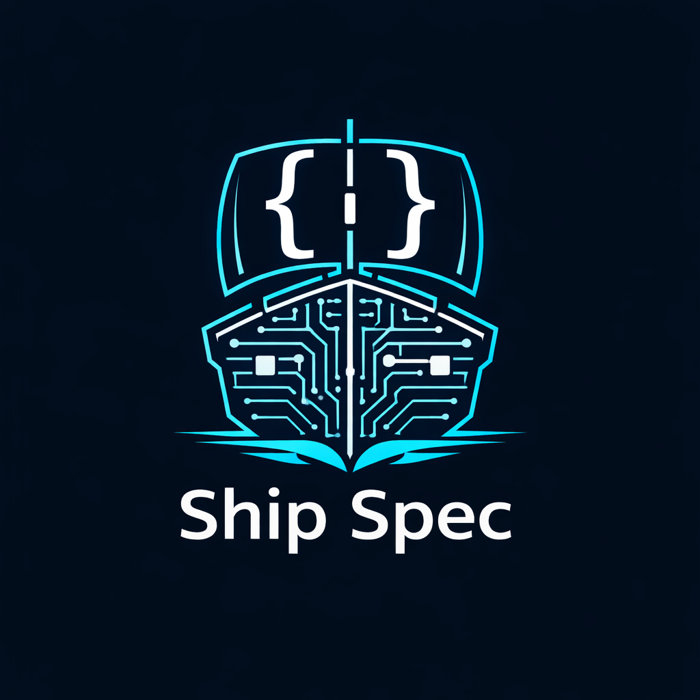

<p align="center">
  
  <h1 align="center">Ship Spec</h1>
  <p align="center">
    <strong>AI-powered codebase analysis and production readiness evaluation</strong>
  </p>
  <p align="center">
    Turn your codebase into actionable production reports with one command.
  </p>
</p>

<p align="center">
  <a href="#-quick-start">Quick Start</a> •
  <a href="#-features">Features</a> •
  <a href="#-installation">Installation</a> •
  <a href="#-usage">Usage</a> •
  <a href="#-configuration">Configuration</a> •
  <a href="#-contributing">Contributing</a>
</p>

> [!WARNING]
> **Under Construction**: This CLI tool is currently in active development and is **not yet fully functional**. Some features may be missing, broken, or change significantly without notice.

---

## Why Ship Spec?

Understanding a codebase's production readiness is hard. Manual security and reliability audits are tedious. **Ship Spec** bridges the gap by using AI to analyze your code semantically and generate comprehensive production reports on demand.

```bash
# Analyze production readiness
ship-spec productionalize "B2B SaaS handling PII, targeting SOC 2"
```

That's it. Ship Spec handles the rest—parsing your code into semantic chunks, automatically building a searchable vector index, and orchestrating AI agents to evaluate your project against industry standards.

---

## ✨ Features

- **🔍 Semantic Code Understanding** — Uses Tree-sitter for AST-based parsing across TypeScript, JavaScript, Python, Go, and Rust
- **🧠 Agentic Workflow** — LangGraph.js orchestrates a Map-Reduce pattern with planning, parallel analysis, and synthesis
- **🛡️ Production Readiness Analysis** — Hybrid planner combines deterministic signals with dynamic research and SAST scans
- **🗄️ Local-First Vector Store** — Embedded LanceDB for fast similarity search without external dependencies
- **☁️ Multi-Provider Support** — Works with OpenAI, Anthropic, Ollama (local), Google Vertex AI, Mistral, and Azure OpenAI
- **⚡ High Performance** — Concurrent file processing with configurable parallelism and batching

---

## 🚀 Quick Start

### Prerequisites

- **Node.js 20+** required
- An API key from OpenAI, Anthropic, or a running [Ollama](https://ollama.ai) instance

### 1. Install

```bash
npm install -g shipspec-cli
```

### 2. Set up your API key

```bash
# Create a .env file in your project
echo "OPENAI_API_KEY=sk-your-key-here" > .env

# Or for Anthropic
echo "ANTHROPIC_API_KEY=sk-ant-your-key-here" > .env

# Or for local Ollama (no key needed)
echo "OLLAMA_BASE_URL=http://localhost:11434" > .env
```

### 3. Analyze production readiness

```bash
cd your-project
ship-spec productionalize
```

The tool will automatically index your codebase on the first run and incrementally update it whenever you make changes.

---

## 📦 Installation

### Global Installation (Recommended)

```bash
npm install -g shipspec-cli
```

### Local Installation

```bash
npm install shipspec-cli
npx ship-spec --help
```

### From Source

```bash
git clone https://github.com/your-org/shipspec-cli.git
cd shipspec-cli
npm install
npm run build
npm link
```

---

## 📖 Usage

### `ship-spec productionalize [context]`

Analyze your codebase for production readiness. This command automatically indexes your codebase, then combines code analysis, web research (SOC 2, OWASP), and SAST scans to generate a comprehensive report and agent-ready system prompts.

```bash
# Basic usage
ship-spec productionalize

# With specific context
ship-spec productionalize "B2B SaaS handling PII, targeting SOC 2"

# Force full re-indexing
ship-spec productionalize --reindex

# Enable SAST scans (Semgrep, Gitleaks, Trivy)
ship-spec productionalize --enable-scans

# Output report and task prompts to files
ship-spec productionalize -o report.md --task-prompts-output task-prompts.md
```

**Options:**

| Option | Description | Default |
|--------|-------------|---------|
| `-o, --output <file>` | Write report to file | `stdout` |
| `--task-prompts-output <file>` | Write task prompts to file | `stdout` |
| `--reindex` | Force full re-index of the codebase | `false` |
| `--enable-scans` | Run SAST scanners (requires binaries) | `false` |
| `--categories <list>` | Filter to specific categories (csv) | `all` |
| `--no-stream` | Disable real-time progress output | `false` |

### `ship-spec config`

Display the resolved configuration.

```bash
ship-spec config
```

### Global Options

```bash
ship-spec --help        # Show help
ship-spec --version     # Show version
ship-spec -v, --verbose # Enable verbose logging
ship-spec -c, --config <path>  # Use custom config file
```

---

### Configuration Precedence

Ship Spec resolve configuration from multiple sources in the following priority order:

1. **CLI Flags** — Overrides all other settings (e.g., `--config`, `--reindex`)
2. **Environment Variables** — Set directly in your shell or process
3. **Configuration File** — `shipspec.json`, `.shipspecrc`, or `.shipspecrc.json`
4. **Defaults** — Sensible defaults defined in the system schema

### Environment Variables & .env

By default, Ship Spec loads environment variables from a `.env` file in the current working directory **only in non-production environments**.

In **production** (`NODE_ENV=production`), `.env` loading is strictly controlled to prevent accidental configuration leakage.

#### Production Requirements
If you MUST use a `.env` file in production, the following guardrails apply:
1. **Explicit Opt-in**: Set `SHIPSPEC_LOAD_DOTENV=1`.
2. **Absolute Path**: You must provide an absolute path to the `.env` file via `SHIPSPEC_DOTENV_PATH`. Implicit loading from the current directory is disabled.
3. **Override Acknowledgment**: If you use `SHIPSPEC_DOTENV_OVERRIDE=1` to overwrite existing process variables, you must also set `SHIPSPEC_DOTENV_OVERRIDE_ACK=I_UNDERSTAND`.

Example for production:
```bash
NODE_ENV=production \
SHIPSPEC_LOAD_DOTENV=1 \
SHIPSPEC_DOTENV_PATH=/etc/shipspec/.env \
ship-spec productionalize
```

By default, `.env` will **not** overwrite environment variables that are already set in your process unless `SHIPSPEC_DOTENV_OVERRIDE=1` is set (with acknowledgment in production).

---

## 🤝 Contributing

We welcome contributions! Here's how to get started:

### Development Setup

```bash
git clone https://github.com/your-org/shipspec-cli.git
cd shipspec-cli
npm install
npm run build
```

### Commands

```bash
npm run dev          # Watch mode
npm run typecheck    # Type checking
npm run lint         # Linting
npm test             # Run tests
npm run test:watch   # Tests in watch mode
npm run test:coverage # Coverage report
```

---

## 📄 License

This project is licensed under the MIT License - see the [LICENSE](LICENSE) file for details.

---

## 🙏 Acknowledgments

Built with these amazing open-source projects:

- [LangChain.js](https://js.langchain.com/) — AI application framework
- [LangGraph.js](https://langchain-ai.github.io/langgraphjs/) — Agentic workflow orchestration
- [LanceDB](https://lancedb.com/) — Embedded vector database
- [Tree-sitter](https://tree-sitter.github.io/) — Incremental parsing system
- [Commander.js](https://github.com/tj/commander.js/) — CLI framework

---

<p align="center">
  Made with ❤️ by the Ship Spec community
</p>
