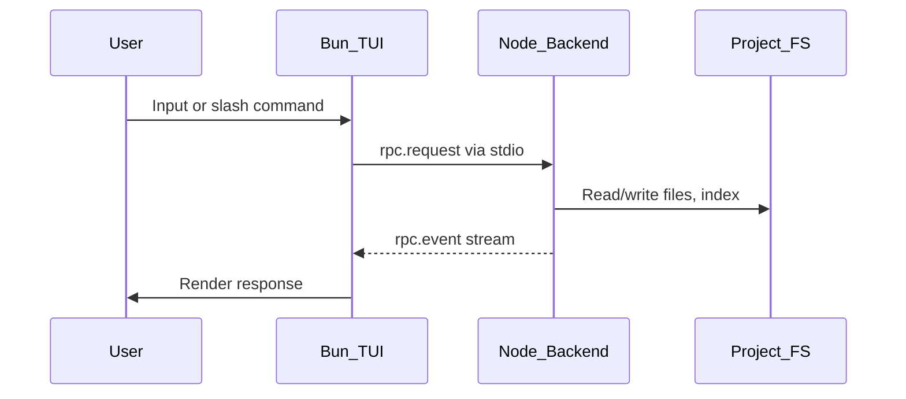

# Ship Spec OpenTUI Migration Plan

## Overview

Migrate the Ship Spec CLI from Commander.js to an OpenTUI-based terminal application following OpenCode's architectural patterns. The new TUI will provide an interactive experience similar to OpenCode, with Ask mode as default, Tab-based mode switching to Plan mode, and slash commands for key functionality.

## Architecture

### Two-Process Model

The migration uses a **Bun TUI frontend + Node backend** architecture communicating via stdio JSON-RPC (NDJSON). This approach is chosen because:

- OpenTUI is Bun-first (`engines: { bun: ">=1.2.0" }`)
- Ship Spec's native dependencies (keytar, better-sqlite3, lancedb) have ABI compatibility issues with Bun
- Clean separation isolates TUI rendering from heavy backend operations
- Matches OpenCode's architectural pattern



### Data Flow

1. **TUI (Bun)**: Renders UI, handles input, displays streaming responses
2. **Backend (Node)**: Runs existing LangGraph agents, RAG, vector store, keytar secrets
3. **Communication**: NDJSON over stdio (Bun spawns Node process)

## Entry Point Behavior

The CLI uses a `--headless` flag for CI/CD compatibility:

- `ship-spec` (no args) - Launches TUI
- `ship-spec --headless ask "question"` - Headless ask mode
- `ship-spec --headless planning "idea" --cloud-ok` - Headless planning
- `ship-spec --headless productionalize` - Headless production readiness
- `ship-spec --headless init` - Headless initialization (for CI/CD)
- `ship-spec --headless model list|current|set` - Headless model management

## UX Mapping

| TUI Feature | Equivalent Command | Implementation |
|------------|-------------------|----------------|
| Default mode (Ask) | `ship-spec ask` | [src/cli/commands/ask.ts](src/cli/commands/ask.ts) |
| Tab to Plan mode | `ship-spec planning` | [src/cli/commands/planning.ts](src/cli/commands/planning.ts) |
| `/connect` | `ship-spec init` | [src/cli/commands/init.ts](src/cli/commands/init.ts) |
| `/model` | `ship-spec model` | [src/cli/commands/model.ts](src/cli/commands/model.ts) |
| `/production-readiness-review` | `ship-spec productionalize` | [src/cli/commands/productionalize.ts](src/cli/commands/productionalize.ts) |
| `/help` | New | Show available commands and keybinds |
| `/clear` | New | Clear conversation history |
| `/exit`, `/quit` | New | Exit the application |

## Project Structure

```
shipspec-cli/
├── tui/                              # Bun TUI (new)
│   ├── package.json                  # Bun-specific deps
│   ├── tsconfig.json                 # JSX for SolidJS
│   ├── src/
│   │   ├── index.tsx                 # TUI entry point
│   │   ├── app.tsx                   # Root App component
│   │   ├── rpc/
│   │   │   ├── client.ts             # RPC client (spawn Node, send/receive)
│   │   │   └── protocol.ts           # Event/request type definitions
│   │   ├── state/
│   │   │   └── app-state.ts          # SolidJS signals (mode, messages, etc.)
│   │   ├── components/
│   │   │   ├── layout/
│   │   │   │   ├── header.tsx        # Mode indicator, model, help hint
│   │   │   │   ├── transcript.tsx    # Scrollable message list
│   │   │   │   └── prompt.tsx        # Input with autocomplete
│   │   │   ├── chat/
│   │   │   │   ├── message.tsx       # Single message (user/assistant)
│   │   │   │   └── streaming.tsx     # Streaming token display
│   │   │   ├── dialogs/
│   │   │   │   ├── model-selector.tsx
│   │   │   │   ├── connect-wizard.tsx
│   │   │   │   └── review-dialog.tsx # PRD/spec review with approve/feedback
│   │   │   └── forms/
│   │   │       └── questionnaire.tsx # Clarification questions
│   │   ├── commands/
│   │   │   └── registry.ts           # Slash command definitions
│   │   └── keybinds/
│   │       └── index.ts              # Keybind configuration
├── src/                              # Node backend (existing + new)
│   ├── backend/                      # New backend RPC server
│   │   ├── server.ts                 # stdio RPC server entry
│   │   └── handlers/                 # RPC method handlers
│   │       ├── ask.ts
│   │       ├── planning.ts
│   │       ├── productionalize.ts
│   │       ├── connect.ts
│   │       └── model.ts
│   ├── flows/                        # New UI-agnostic flow modules
│   │   ├── ask-flow.ts               # Async generator for ask events
│   │   ├── planning-flow.ts          # Planning with interrupt events
│   │   ├── productionalize-flow.ts   # Production review with events
│   │   ├── connect-flow.ts           # Initialization flow
│   │   └── model-flow.ts             # Model management flow
│   ├── cli/                          # Modified for --headless routing
│   │   └── index.ts                  # Routes to TUI or headless handlers
│   ├── agents/                       # Unchanged
│   ├── core/                         # Unchanged
│   ├── config/                       # Unchanged
│   └── utils/                        # Unchanged
```

## RPC Protocol

### Event Schema

All communication uses NDJSON (newline-delimited JSON) over stdio.

```typescript
// Base event types
type RPCEvent = 
  | { type: "status"; message: string }
  | { type: "progress"; stage: string; percent?: number }
  | { type: "token"; content: string }
  | { type: "interrupt"; payload: InterruptPayload }
  | { type: "complete"; result: unknown }
  | { type: "error"; code: string; message: string };

// Request types
type RPCRequest = 
  | { method: "ask.start"; params: { question: string; history?: ConversationEntry[] } }
  | { method: "ask.cancel" }
  | { method: "planning.start"; params: { idea: string; trackId?: string } }
  | { method: "planning.resume"; params: { trackId: string; response: InterruptResponse } }
  | { method: "productionalize.start"; params: { context?: string } }
  | { method: "productionalize.resume"; params: { sessionId: string; response: InterruptResponse } }
  | { method: "connect"; params: { openrouterKey: string; tavilyKey?: string } }
  | { method: "model.list" }
  | { method: "model.current" }
  | { method: "model.set"; params: { model: string } };

// Interrupt payloads (planning/productionalize)
type InterruptPayload =
  | { kind: "clarification"; questions: string[] }
  | { kind: "document_review"; docType: "prd" | "spec" | "report"; content: string }
  | { kind: "interview"; questions: InterviewQuestion[] };
```

## Backend Refactor

### Flow Modules

Extract UI-agnostic logic from Commander commands into async generators that emit events:

**Ask Flow** (based on [src/cli/commands/ask.ts](src/cli/commands/ask.ts)):

```typescript
// src/flows/ask-flow.ts
export async function* askFlow(
  question: string,
  config: ShipSpecConfig,
  secrets: ShipSpecSecrets,
  history: ConversationEntry[]
): AsyncGenerator<AskEvent> {
  yield { type: "status", message: "Searching codebase..." };
  const chunks = await repository.hybridSearch(question, 10);
  
  yield { type: "status", message: "Generating answer..." };
  const stream = await model.stream(messages);
  for await (const chunk of stream) {
    yield { type: "token", content: chunk.content };
  }
  
  yield { type: "complete", result: { answer: fullResponse } };
}
```

**Planning Flow** (based on [src/cli/commands/planning.ts](src/cli/commands/planning.ts)):

- Encapsulates `graph.invoke()` + `__interrupt__` loop
- Emits `interrupt` events for clarification questions and document reviews
- Accepts `resume` with user responses

**Productionalize Flow** (based on [src/cli/commands/productionalize.ts](src/cli/commands/productionalize.ts)):

- Normalizes interview interrupts into event-driven model
- Streams progress for planner/worker/aggregator stages
- Emits report_review interrupt, then final report + task prompts

### Backend RPC Server

```typescript
// src/backend/server.ts
import { createInterface } from "readline";

const rl = createInterface({ input: process.stdin });

for await (const line of rl) {
  const request = JSON.parse(line);
  const handler = handlers[request.method];
  
  for await (const event of handler(request.params)) {
    process.stdout.write(JSON.stringify(event) + "\n");
  }
}
```

## TUI Implementation

### Dependencies (tui/package.json)

```json
{
  "name": "shipspec-tui",
  "type": "module",
  "dependencies": {
    "@opentui/core": "^0.1.0",
    "@opentui/solid": "^0.1.0",
    "solid-js": "^1.8.0"
  }
}
```

### App State

```typescript
// tui/src/state/app-state.ts
import { createSignal } from "solid-js";

export const [mode, setMode] = createSignal<"ask" | "plan">("ask");
export const [messages, setMessages] = createSignal<Message[]>([]);
export const [isProcessing, setIsProcessing] = createSignal(false);
export const [currentModel, setCurrentModel] = createSignal("gemini-flash");
export const [activeDialog, setActiveDialog] = createSignal<DialogType>("none");
```

### Keybinds

- `Tab` - Toggle Ask/Plan mode (when autocomplete not open)
- `Ctrl+C` - Cancel current operation / Exit
- `Ctrl+L` - Clear screen
- `Enter` - Submit input
- `Up/Down` - History navigation

### Slash Commands

| Command | Description |
|---------|-------------|
| `/connect` | Configure API keys (opens dialog) |
| `/model` | Show model selector dialog |
| `/model list` | List available models |
| `/model set <alias>` | Set model directly |
| `/production-readiness-review [context]` | Run production readiness analysis |
| `/prr` | Alias for /production-readiness-review |
| `/help` | Show available commands and keybinds |
| `/clear` | Clear conversation history |
| `/exit`, `/quit` | Exit the application |

### Mode Behaviors

**Ask Mode (Default)**:

1. User enters question
2. TUI sends `ask.start` to backend
3. Backend streams: status -> tokens -> complete
4. TUI renders response with markdown

**Plan Mode (Tab to switch)**:

1. User enters idea (or resumes with track ID)
2. TUI sends `planning.start` to backend
3. Backend may send `interrupt` events:

   - `clarification`: TUI shows questionnaire form
   - `document_review`: TUI shows review dialog (Approve/Feedback)

4. User responds, TUI sends `planning.resume`
5. Continues until `complete` with PRD, spec, and tasks

## CLI Entry Point Changes

```typescript
// src/cli/index.ts
async function main() {
  const isHeadless = process.argv.includes("--headless");
  const isTTY = process.stdout.isTTY;
  
  if (isHeadless || !isTTY) {
    // Strip --headless and run existing Commander commands
    const args = process.argv.filter(a => a !== "--headless");
    await program.parseAsync(args);
  } else {
    // Launch TUI by spawning Bun process
    await launchTUI();
  }
}

async function launchTUI() {
  const tuiPath = join(__dirname, "../../tui/src/index.tsx");
  const proc = spawn("bun", ["run", tuiPath], {
    stdio: "inherit",
    env: { ...process.env, SHIPSPEC_PROJECT_ROOT: process.cwd() }
  });
  proc.on("exit", (code) => process.exit(code ?? 0));
}
```

## Security Considerations

1. **Secret Redaction**: Apply existing [redaction.ts](src/utils/redaction.ts) to all RPC responses
2. **Terminal Sanitization**: Use [terminal-sanitize.ts](src/utils/terminal-sanitize.ts) before rendering
3. **API Key Handling**: Keys never leave backend; `/connect` dialog masks input
4. **Path Traversal**: Validate track IDs as in [planning.ts](src/cli/commands/planning.ts:62-78)

## Build & Packaging

### npm Package Changes

```json
{
  "bin": {
    "ship-spec": "dist/cli/index.js"
  },
  "scripts": {
    "build": "tsc --project tsconfig.build.json && cd tui && bun run build",
    "build:tui": "cd tui && bun run build"
  }
}
```

### CI Updates

1. Add Bun installation step
2. Add TUI build step
3. Add RPC protocol tests
4. Keep existing vitest suite for backend

## Implementation Phases

### Phase 1: Foundation

- Set up tui/ directory with Bun/OpenTUI
- Create RPC protocol types and basic server
- Implement CLI routing (--headless vs TUI)

### Phase 2: Ask Mode

- Extract ask-flow.ts from ask.ts
- Implement TUI ask mode with streaming
- Test end-to-end ask flow

### Phase 3: Slash Commands

- Implement /connect, /model, /help, /clear, /exit
- Add command autocomplete
- Test command execution

### Phase 4: Plan Mode

- Extract planning-flow.ts from planning.ts
- Implement interrupt handling in TUI
- Add questionnaire and review dialog components

### Phase 5: Production Readiness

- Extract productionalize-flow.ts
- Implement /production-readiness-review with interrupts
- Add progress display and report viewer

### Phase 6: Polish

- Full keybind configuration
- History navigation
- Visual refinements
- Comprehensive testing

## Key Files to Modify

- [package.json](package.json) - Add build scripts, update bin
- [src/cli/index.ts](src/cli/index.ts) - Add --headless routing
- [tsconfig.json](tsconfig.json) - May need adjustment for tui/

## Key Files to Create

- `tui/package.json` - TUI dependencies
- `tui/tsconfig.json` - JSX config for SolidJS
- `tui/src/index.tsx` - TUI entry point
- `tui/src/app.tsx` - Root component
- `tui/src/rpc/client.ts` - RPC client
- `src/backend/server.ts` - RPC server
- `src/flows/*.ts` - UI-agnostic flow modules
